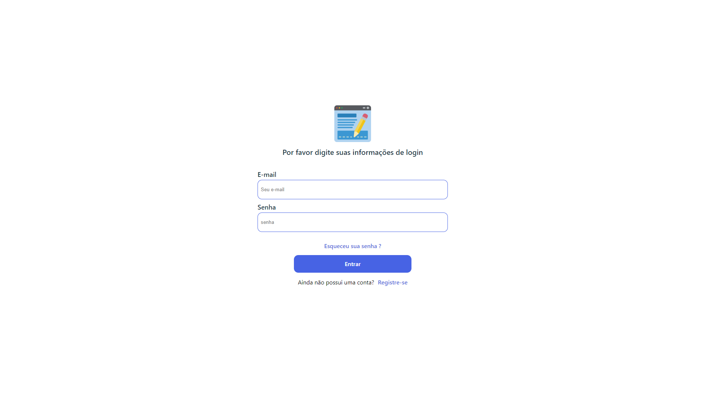

   Firebase/Auth  

<h1 align="center">Tela de Login</h1>
  

    

 
<h1 align="center">Tela de Cadastro</h1>
  

     

<h2>Projeto</h2>

Este é um projeto de uma tela de login feito em React usando o sistema de autenticação do Firebase e o fireStore como banco de dados.

  

<h1 align="center">Tela Home</h1>
  

     

<h2>Tecnologias</h2>
<ul>
   <li>React</li>
   <li>Firebase</li>
</ul>
